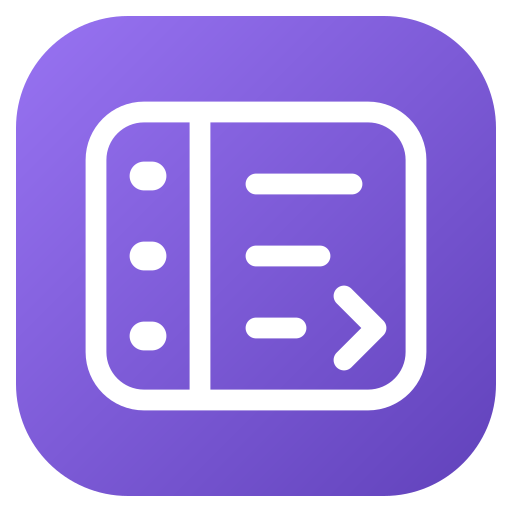

# Collapsible Ribbon

Make Obsidian's left ribbon easier to use with labelled actions.

- **Hover to expand:** See icon labels in a rail over nearby content. Your editor stays in place.
- **Pin it open:** The rail stays visible and the editor makes room for it.
- **Resize it:** Drag the right edge to set a width from 120 to 300 px. The default is 220 px.

Your existing ribbon buttons, including those added by other plugins, keep working. Empty buttons left by obsolete plugin icons receive a reversible fallback. Labels use their existing accessible names where available. Tooltips appear while the ribbon is collapsed and are hidden while expanded.

## Use

Hover over a ribbon icon to open the rail. Click the pin at the bottom to keep it open; click again to return to hover mode. Drag the right edge to resize. You can also focus the resize handle and use Left/Right arrows (1 px), Shift+arrows (10 px), or Home/End.

The plugin remembers your ribbon order, pin state and width across restarts. Reorder icons by dragging or through **Settings → Interface → Ribbon menu configuration**. Both views stay synchronized, and late-loading plugins return to their saved positions. Its searchable settings let you change the width or turn off animations and labels.

## Install

For manual installation, download the ZIP from the [latest release](https://github.com/an1uk/obsidian-collapsible-ribbon/releases/latest) and extract its `collapsible-ribbon` folder into your vault's `.obsidian/plugins/` directory. Then enable **Collapsible Ribbon** in Obsidian's Community plugins settings. Requires desktop Obsidian 1.13.7 or later.

[Development and release notes](docs/DEVELOPMENT.md) · [MIT licence](LICENSE)